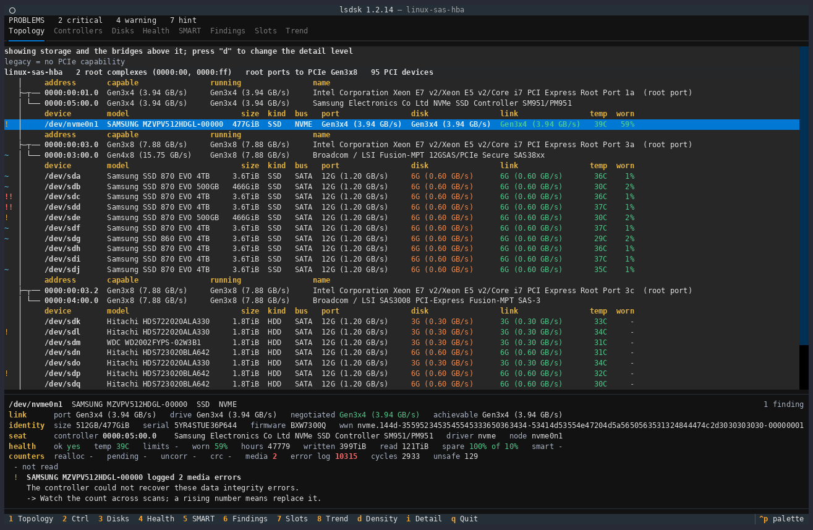
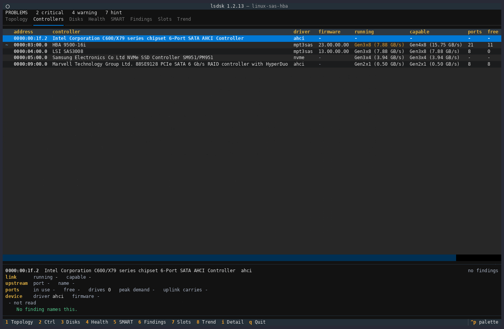
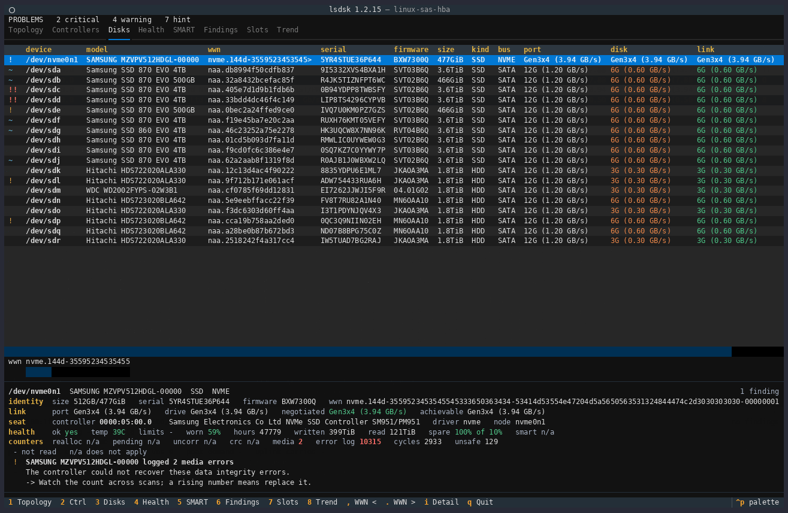
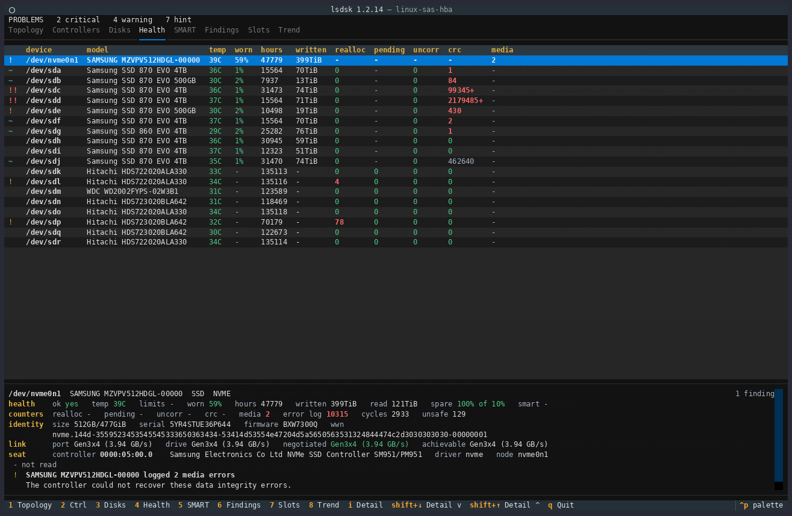
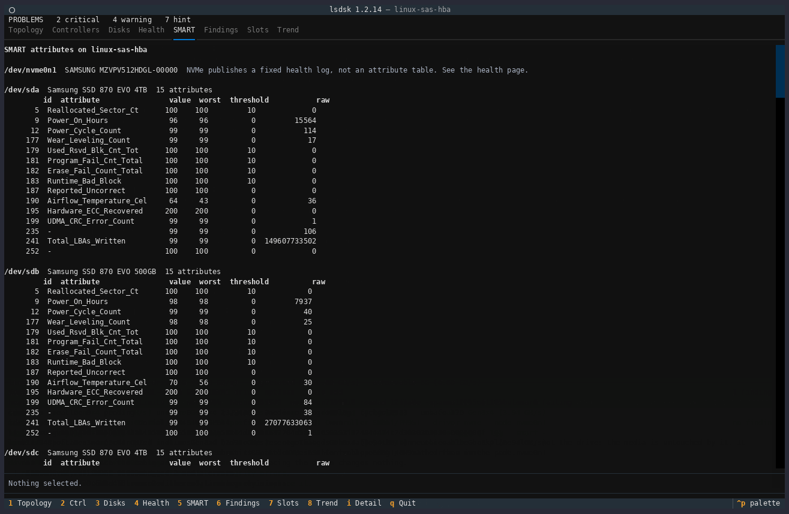
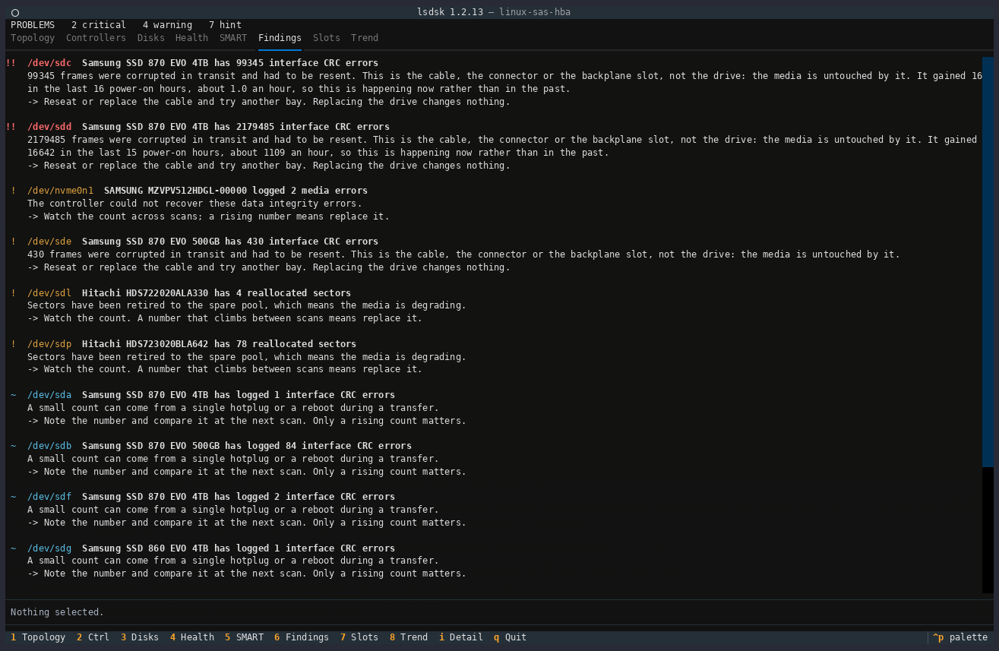
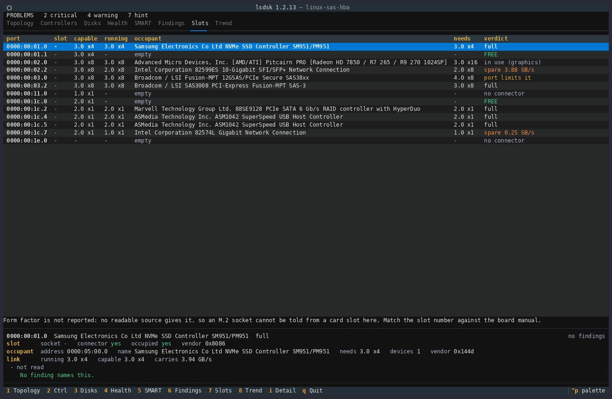
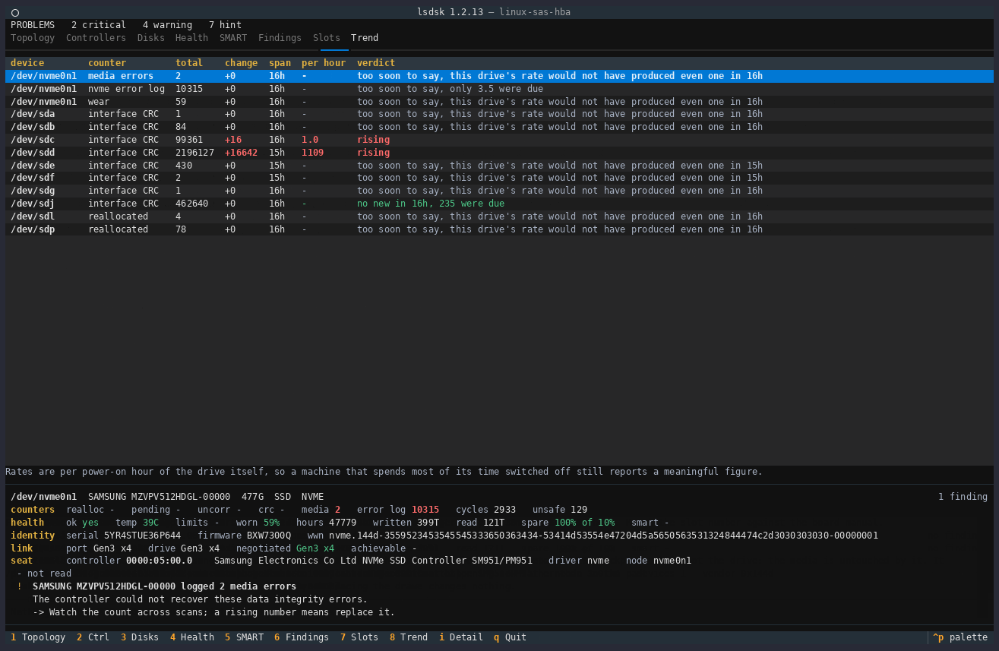

# The eight pages

One page per question, in the order the number keys reach them. Each is also a
subcommand printing the same view, so `4` and `lsdsk health` are one thing under
one name. Back to the [README](README.md).

The interactive view is keyed the way the `*top` family is: `1` to `8` or the
matching function key switch page, and `q` quits; the footer lists those, so
there is nothing to memorise. `left`, `right`, `tab` and `shift+tab` also step
between pages, and `r` rescans, without appearing in the footer.
The pages carry the same names as the commands, in the same order, so `4` and
`lsdsk health` are the same view, drawing the same columns.
Each page stands alone and shows every disk, so nothing has to be selected to
read one.

Six of the eight pages also carry a cursor - topology, controllers, disks,
health, slots and trend - which `up` and `down` move. A panel under the table
answers for whatever the cursor is on: every value the row had no column for,
then the findings that name it, with their reasoning and their remedy. The
record belongs to the subject rather than to the page, so a drive reads the
same wherever it is met and only the order of its groups changes. `i` hides the
panel and gives the table the whole screen; `shift+up` and `shift+down` scroll
inside it, and are offered only when the record is taller than the panel is.
SMART and findings carry no cursor, scroll as a page, and the panel reads
`Nothing selected.` there.

Two keys answer on one page each, and the footer offers them there and
nowhere else. `d` cycles how much of the PCI fabric the topology page draws,
the same setting `--tree-density` sets for every view. `,` and `.` scroll the
strip under the disks table that holds the whole identifier of the drive the
cursor is on, which is how a WWN too long for its column stays readable.

## 1 Topology

What is wrong comes first, then the machine itself: each controller with the link it negotiated
against the link it could have run, and the drives hanging under it. Stopping after this page
still leaves nothing actionable unseen.

## 2 Controllers

One row per controller: driver and firmware, running against capable, how many ports it has and
how many are free, and what the drives on it would pull together. That last column is what turns
a free port into an honest answer rather than a tempting one.

## 3 Disks

One row per drive, with the identity you need to order a replacement: model, WWN, serial and
firmware, then size, bus and the three speeds. `port` is what the seat can give, `disk` what the
drive can do, `link` what the two of them agreed on. A speed carries what it is worth, because a
shape says nothing about throughput to a reader who does not keep the PCIe lane table in their
head, and `size` names the scale it is written on: a drive is sold in powers of ten and reports in
powers of two, so `466GiB` is the drive whose label says 500 GB.

## 4 Health

Wear, temperature, power-on hours and bytes written, beside the counters that decide whether a
drive is dying or merely badly cabled: reallocated, pending, uncorrectable, interface CRC and
media errors.

## 5 SMART

Every attribute of every drive, with value, worst and threshold beside the raw number, because a
raw count means nothing without the threshold the drive itself judges it against. NVMe drives
publish a fixed health log instead of an attribute table, and the page says so rather than
leaving a gap.

## 6 Findings

Each finding with its reasoning underneath and a remedy: what was measured, what it means, and
what to do about it. This is where a CRC count is named as the cable rather than the drive.

## 7 Slots

Every PCIe port: what it can carry, what it is running, what occupies it, what that occupant
needs, and a verdict. `FREE` is an empty port, `full` means the occupant uses what the port
offers, and a spare figure is bandwidth nobody is using.

## 8 Trend

What each counter is DOING rather than what it totals: the change since the last reading, the
span it was measured over, a rate per hour, and a verdict. Two drives here read `rising`. One
reads `no new in 16h, 235 were due`, a counter that has stopped climbing, which is only sayable
because the drive's own lifetime rate says how many were expected. The rest say `too soon to say`,
the honest answer until enough of the drive's own clock has passed.
