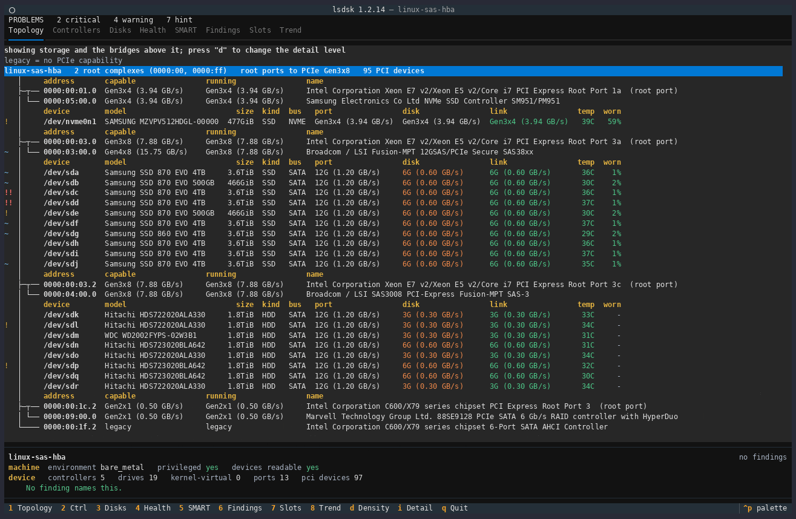

# lsdsk

**English** | [Deutsch](de/README.md)

<!-- Badges -->
[](https://github.com/bitranox/lsdsk/actions/workflows/default_cicd_public.yml)
[](https://github.com/bitranox/lsdsk/actions/workflows/codeql.yml)
[](LICENSE)
[](https://codespaces.new/bitranox/lsdsk?quickstart=1)
[](https://pypi.org/project/lsdsk/)
[](https://pypi.org/project/lsdsk/)
[](https://docs.astral.sh/ruff/)
[](https://codecov.io/gh/bitranox/lsdsk)
[](https://qlty.sh/gh/bitranox/projects/lsdsk)
[](https://github.com/PyCQA/bandit)

lsdsk is a storage diagnostic for Linux and Windows: it groups every disk under the
controller and the PCIe path it hangs off, grades each link against what both of its ends
could do, reads SMART wear and error counters, and says which of the differences it finds is
worth acting on.

c't Magazin covered it on 17 September 2026, in German:
[Kommandozeilentool lsdsk: Performance-Engpässe bei SSDs und Controllern finden](https://www.heise.de/ratgeber/Kommandozeilentool-lsdsk-Performance-Engpaesse-bei-SSDs-und-Controllern-finden-11440011.html).

Ten drives, three controllers, a chipset and a riser between them and the CPU. The machine
boots fine, and nothing on it tells you that one card negotiated x1 in an x8 slot, that two
SSDs share a link narrower than either of them alone, or that the free port you were about
to fill hangs off an uplink that is already full. A storage server rarely fails outright. It
runs at a fraction of what it cost, quietly, for years, and the parts that would explain it
are spread across sysfs, a set of ioctls and the mainboard manual.

lsdsk is the quick look before you buy or blame anything: where every drive hangs, what each
link negotiated against what it could have done, which slots are free and what they are
worth, and where the bottleneck actually is rather than where it is easiest to see.

It starts no subprocesses and makes no network requests: every figure it prints was read
here, from sysfs and direct ioctls on Linux and from SetupAPI and DeviceIoControl on
Windows.

## QUICKSTART

The command below needs `uv` and nothing else; if it is not installed yet,
[INSTALL.md](INSTALL.md#easiest-install-and-run-with-uv) has the one-line installer for Linux,
macOS and Windows.

For full information run it as root or Administrator (`sudo`). Without that, SMART wear, the
error counters, PCIe connector detection and a SATA controller's port count read as `-`, and the
header says so. [INSTALL.md](INSTALL.md#what-needs-root) has the list.

```bash
# run as Administrator or root for full information 
uvx lsdsk@latest          # lsdsk TUI
uvx lsdsk@latest report   # get a printed report
uvx lsdsk@latest --help   # get further help
```

That is the whole command. At a terminal it opens an interactive view with a
page per question; piped or redirected it prints the same machine as one page:
the mainboard, what is wrong, the controller tree, every disk's identity, wear
and error counters, every SMART attribute, the PCIe slots, and each finding with
its reasoning.

## The TUI

Number keys switch between the pages, `Tab` cycles, and every page is also a subcommand, so `lsdsk health` prints exactly what page 4 shows.



Six of the eight pages carry a cursor, and a panel under the table answers for
whatever it is on: every value the row had no column for, then the findings that
name it. [PAGES.md](PAGES.md) walks through all eight, with a picture of each and
the keys that reach them.

Piped, redirected or asked for by name, the same machine prints as one page
instead, worst first, so stopping after the first screen still shows everything
actionable. [REPORT.md](REPORT.md) shows that page and says when to ask for it
explicitly.

## Privileges

It runs unprivileged and says what that costs. Topology, PCIe link state, SATA
capability and negotiated speed, SAS phy rates, capacity, controller firmware
and NVMe temperature all read without any privilege at all.

Four things need root or Administrator, and none is guessed without it:

- **SMART attributes and wear.** Those columns read `-`.
- **The error counters, so `trend` and `record`.** Same passthrough read, so an
  unelevated run records nothing at all and no trend can be built from it.
- **PCIe slot numbers and whether a port is a real connector.** The capability
  structures holding them sit past the first 64 bytes of config space, which is
  where an unprivileged read stops. Without them the `slot` column reads `-`,
  and no card move is ever proposed, because a port that cannot be confirmed as
  a physical connector might be soldered-down silicon.
- **The AHCI capability register**, which needs the controller's BAR5 mapped and
  carries both the ports-implemented bitmap, giving a SATA controller's
  free-port count, and the speed the port itself can carry, which is the `port`
  column on every SATA row. Without it both read `-`. This one is refused on
  some hosts even as root, so a `-` there is not proof of an unprivileged run.

In a container none of it comes back, because the device nodes are not there to
read; elevating changes nothing.

Spare bandwidth on a port is reported either way: it is a measurement, and a
measurement is shown whether or not a card could actually be moved there.

## It ships a skill for Claude Code

The hard part of a storage report is not reading it, it is knowing which findings
deserve action. lsdsk ships that judgement as a Claude Code skill, so an agent
reading the output reaches the same conclusions a practised admin would.

```
/plugin marketplace add bitranox/lsdsk
/plugin install lsdsk
```

The skill teaches what the tool cannot: that a CRC count is the cable and never
the drive, that a wear percentage means nothing without the drive's own
threshold, that a controller capped by the board has two opposite remedies
depending on whether a faster port exists and is merely occupied, and that a
slot number is matched against the mainboard manual because no readable source
gives the form factor. It also says where to go when lsdsk stops: the tool makes
no network request by design, but an agent can fetch the board manual or the HBA
datasheet, and the skill says which questions that answers and how to keep the
looked-up figures apart from the measured ones.

## Install

```bash
uvx lsdsk@latest       # run without installing
uv tool install lsdsk  # install for repeated use
pip install lsdsk
```

Python 3.11 or newer, Linux or Windows. It shells out to nothing: no
`smartmontools`, no `nvme-cli`, no `lspci`, no subprocess of any kind, and no
network access at any point. Its own Python dependencies are declared in
`pyproject.toml`.

Turning a controller's numeric identifiers into a name is the one thing it
cannot read off the hardware, so it ships the PCI name database and uses the
system's own copy in preference where there is one. That is why a controller
reads the same on Linux and on Windows, and why it reads in English on a
machine whose operating system is not: Windows localises its device
descriptions, and lsdsk does not quote them. See `NOTICE` for that file's
licence.

## How it works

Linux reads sysfs and issues `SG_IO` ATA passthrough and NVMe admin ioctls
directly. A SATA port's own speed comes from the AHCI controller's capability
register, because `libata` publishes a port speed only once a limit has been
applied to it, so on healthy hardware sysfs has no answer at all. Windows uses `SetupAPI` and `DeviceIoControl` through `ctypes`, with
no WMI and no PowerShell. Both platforms receive the same ATA IDENTIFY, ATA
SMART and NVMe structures, so a single set of decoders serves both and is tested
against captures from real hardware on every supported operating system.

Every command it issues is a read. It never writes to a device.

## Documentation

| Document                                                                       | What it covers                                                                       |
|--------------------------------------------------------------------------------|--------------------------------------------------------------------------------------|
| [PAGES.md](PAGES.md)                                                           | The eight pages, the keys that reach them, and what each one answers                 |
| [REPORT.md](REPORT.md)                                                         | The one-page report, and when to name it rather than let the terminal decide         |
| [COMMANDS.md](COMMANDS.md)                                                     | Every command and global option, the JSON envelope, and the exit codes               |
| [FINDINGS.md](FINDINGS.md)                                                     | What it reports, what evidence each rule needs, and what it refuses to guess         |
| [WHY.md](WHY.md)                                                               | The problem it was written for, and the two cases easiest to get wrong without it    |
| [INSTALL.md](INSTALL.md)                                                       | Installing it, and what works unprivileged versus what needs root                    |
| [CONFIG.md](CONFIG.md)                                                         | Every configuration key, the layered sources, and the env-var forms                  |
| [DEVELOPMENT.md](DEVELOPMENT.md)                                               | Working on lsdsk: the gate, the test lanes, capturing a fixture                      |
| [CONTRIBUTING.md](CONTRIBUTING.md)                                             | How to propose a change                                                              |
| [SECURITY.md](SECURITY.md)                                                     | Reporting a vulnerability                                                            |
| [CHANGELOG.md](CHANGELOG.md)                                                   | What changed, and when                                                               |
| [docs/systemdesign/module_reference.md](docs/systemdesign/module_reference.md) | Every module, the layer rule, the CLI commands and the exit codes                    |
| [ai-transparency.md](ai-transparency.md)                                       | Where an AI assistant was used, what was verified on real hardware, and what was not |
| [ai-stance.md](ai-stance.md)                                                   | Why the project takes that position                                                  |

## Licence

MIT.
